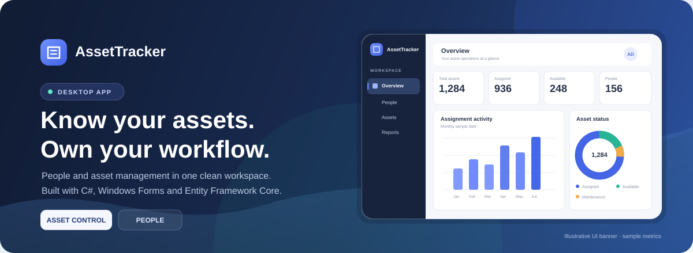
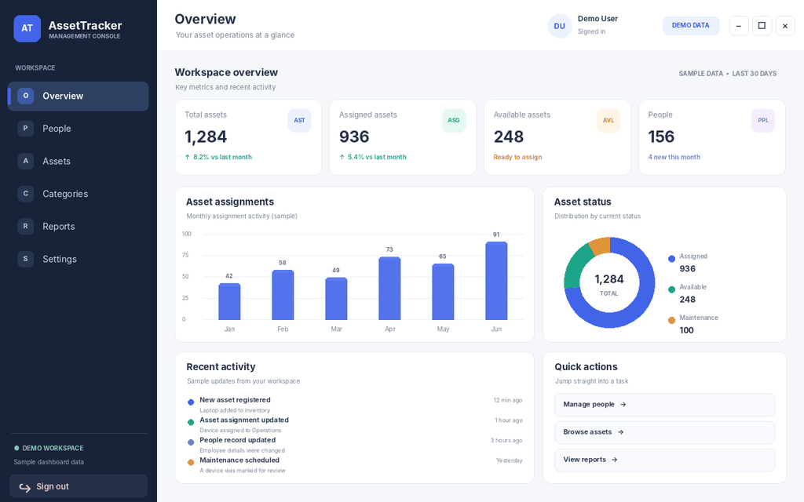
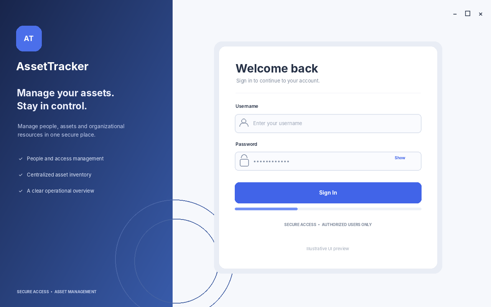
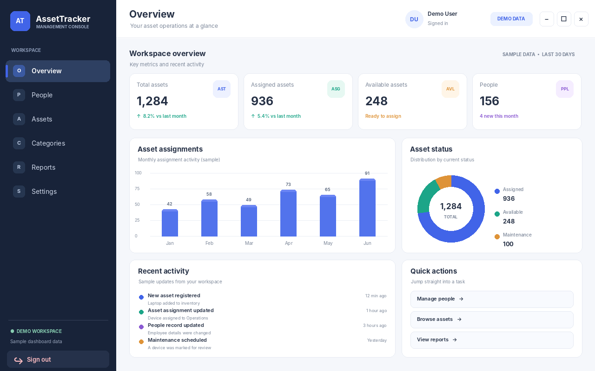
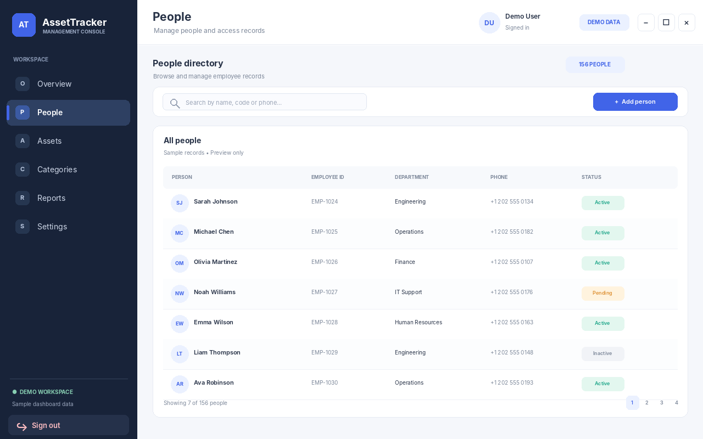
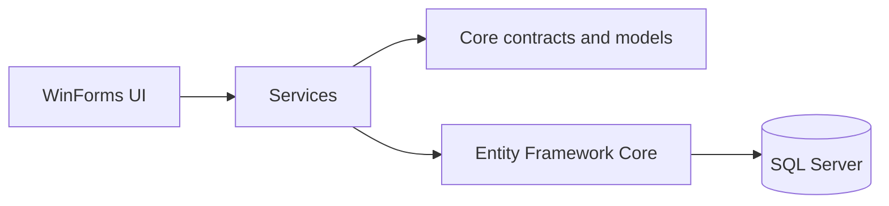

<div align="center">
  

  <h1>AssetTracker</h1>
  <p><strong>A desktop workspace for people and asset management.</strong></p>
  <p>
    A C# Windows Forms application with a dashboard-style interface, authentication, people management, and an Entity Framework Core data layer.
  </p>

  <p>
    
    
    
    
  </p>

  <p>
    <a href="#features">Features</a> ·
    <a href="#demo-preview">Screenshots</a> ·
    <a href="#tech-stack">Tech Stack</a> ·
    <a href="#getting-started">Getting Started</a> ·
    <a href="#project-structure">Structure</a>
  </p>
</div>

---

## Overview

**AssetTracker** is a Windows desktop application designed to bring people records and asset operations into one workspace. The UI uses a modern dashboard layout with a navigation sidebar, metric cards, charts, recent activity, and quick actions.

> **Current implementation status:** Authentication and the People view are the primary connected flows. Dashboard metrics and charts currently use sample data, while Assets, Categories, Reports, and Settings are UI placeholders awaiting their service implementations.

## Features

<table>
  <tr>
    <td width="50%" valign="top">
      <h3>🔐 Authentication</h3>
      Sign in through the authentication service and keep the current user in the in-memory application session.
    </td>
    <td width="50%" valign="top">
      <h3>👥 People management</h3>
      A dedicated People view backed by the person service for loading records and supporting person operations.
    </td>
  </tr>
  <tr>
    <td width="50%" valign="top">
      <h3>📊 Dashboard overview</h3>
      KPI cards, a monthly activity bar chart, an asset-status donut chart, recent activity, and quick actions.
    </td>
    <td width="50%" valign="top">
      <h3>🧭 Workspace navigation</h3>
      A sidebar with active-page styling and a shared content area for switching views.
    </td>
  </tr>
  <tr>
    <td width="50%" valign="top">
      <h3>👤 User context</h3>
      The signed-in user's available name and role fields are displayed in the dashboard header.
    </td>
    <td width="50%" valign="top">
      <h3>🚪 Sign out</h3>
      Clear the in-memory user reference and return to the login flow.
    </td>
  </tr>
</table>

## Demo Preview

The animated walkthrough below illustrates the intended visual style and navigation flow. It is a **designed mockup with sample content**, not a screen recording of the running application; dashboard values and people records are illustrative.

<p align="center">
  
</p>

<div align="center">
  <table>
    <tr>
      <td align="center" width="50%">
        <strong>Login concept</strong><br />
        
      </td>
      <td align="center" width="50%">
        <strong>Dashboard concept</strong><br />
        
      </td>
    </tr>
    <tr>
      <td align="center" colspan="2">
        <strong>People management concept</strong><br />
        
      </td>
    </tr>
  </table>
</div>

> These visuals are design previews created for the README. Replace them with captures from the running WinForms application when you are ready to show the exact implemented UI.

## Tech Stack

| Layer | Technology |
|---|---|
| Desktop UI | C# / Windows Forms |
| Dependency injection | `Microsoft.Extensions.DependencyInjection` |
| Data access | Entity Framework Core |
| Database | SQL Server (configured by the application) |
| Application code | Core models, DTOs, interfaces, and service classes |
| Charts | Custom GDI+ drawing in WinForms; no chart package required for the current dashboard |

## Getting Started

### Prerequisites

- Windows
- Visual Studio with the **.NET desktop development** workload
- The .NET SDK/runtime targeted by the solution
- SQL Server if you want to run the database-backed flows

### Run locally

1. Clone the repository:

   ```bash
   git clone NotFoundNobody/AssetTracker
   cd NotFoundNobody/AssetTracker
   ```

2. Open the solution (`.sln`) in Visual Studio.
3. Configure the database connection string used by `AppDbContext` and confirm the database schema or migrations are ready.
4. Verify that the application's dependency-injection setup registers the data context and service implementations.
5. Set the WinForms UI project as the startup project.
6. Build and run the solution.

> Configuration keys and the exact migration commands depend on the solution's current setup. Do not commit real database credentials, access tokens, or production secrets to source control.

## Project Structure

The solution is organized around UI, service, core-contract, and data-access responsibilities. Adjust the tree below if the repository uses different folder names.

```text
AssetTracker/
├── Core/
│   ├── DTO/
│   ├── Entities/
│   ├── Interfaces/
│   └── Models/
├── AssetTracker.Data/
│   └── AppDbContext.cs
├── Services/
│   ├── Interfaces/
│   └── Service implementations
└── UI/
    ├── Forms/
    └── Views/
```

### High-level flow



## Roadmap

- [x] Modern login screen and dashboard shell
- [x] People view navigation
- [x] Sample dashboard charts and metrics
- [x] In-memory sign-out flow
- [ ] Connect dashboard metrics to live data
- [ ] Implement Assets and Categories views
- [ ] Add reporting and settings workflows
- [ ] Add automated tests and application logging
- [x] Add illustrative README mockups and an animated preview
- [ ] Replace mockups with screenshots captured from the running application

## Demo Assets

The illustrative GIF and PNG previews are stored in `docs/assets/screenshots/`. To show the exact application UI instead, capture the running WinForms forms and replace these mockup files with those screenshots.

## Contributing

Issues and suggestions are welcome. Before opening a pull request, build the solution and describe the changes and any required configuration updates.


## 📄 License

This project is licensed under a custom **All Rights Reserved** license.

- ✅ Personal and non-commercial use is permitted.
- ❌ Commercial use requires prior written permission.
- ❌ Modification and redistribution are prohibited without prior written permission.

See the [LICENSE](LICENSE) file for the complete terms.
---

<div align="center">
  <sub>Built with C# and Windows Forms · AssetTracker</sub>
</div>
