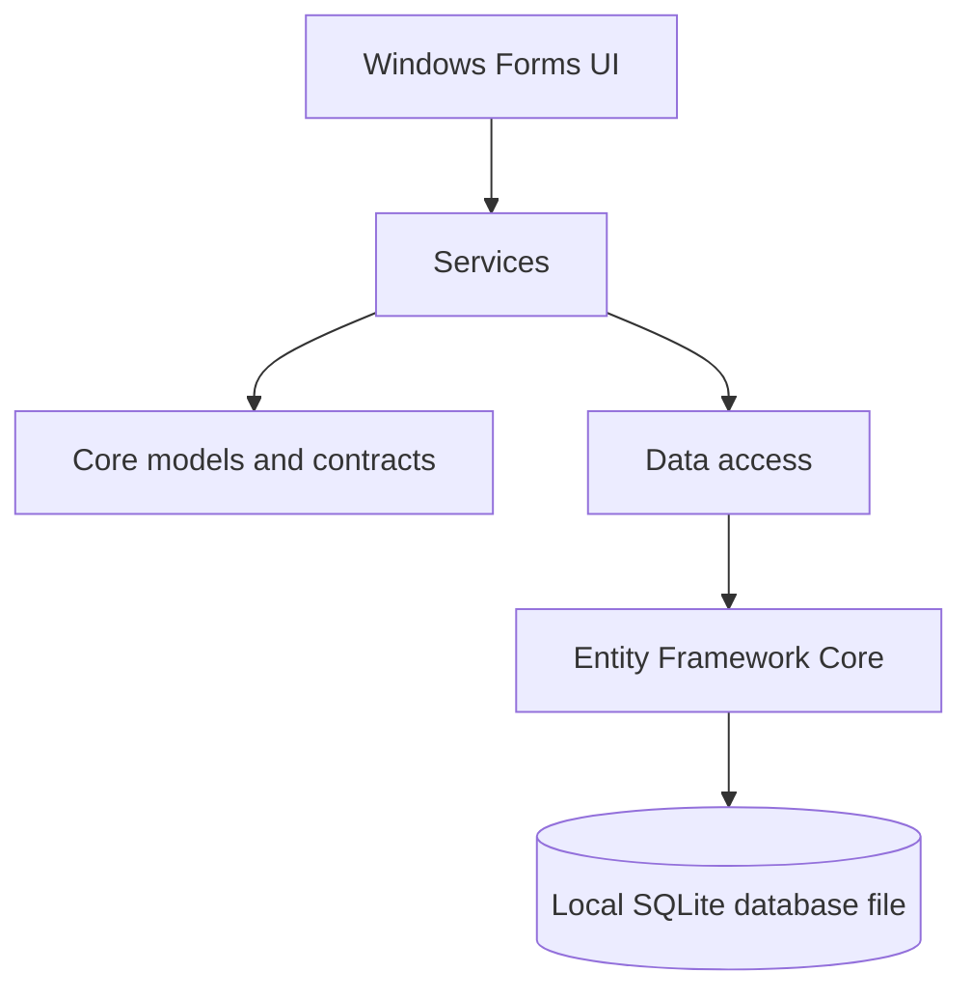

<div align="center">
  

  <h1>AssetTracker</h1>
  <p><strong>A desktop workspace for people and asset management.</strong></p>
  <p>
    A C# Windows Forms application featuring a dashboard-style interface, authentication, people management, and a local SQLite database.
  </p>

  <p>
    
    
    
    
  </p>

  <p>
    <a href="#features">Features</a> ·
    <a href="#demo-preview">Screenshots</a> ·
    <a href="#tech-stack">Tech Stack</a> ·
    <a href="#getting-started">Getting Started</a> ·
    <a href="#project-structure">Structure</a>
  </p>
</div>

---

## Overview

**AssetTracker** is a Windows desktop application designed to bring people records and asset operations into one workspace. The interface uses a dashboard layout with a navigation sidebar, metric cards, charts, recent activity, and quick actions.

The application targets **.NET 10 for Windows** and uses a local SQLite database file. Data access is handled by the `Data` class library, while application service methods are organized in `Services`. The WinForms UI calls these services directly; there is no separate API or backend server.

> **Current implementation status:** Authentication and the People view are the primary connected flows. Dashboard metrics and charts currently use sample data, while Assets, Categories, Reports, and Settings are UI placeholders awaiting their service implementations.

## Features

<table>
  <tr>
    <td width="50%" valign="top">
      <h3>Authentication</h3>
      Sign in through the authentication service and keep the current user in the in-memory application session.
    </td>
    <td width="50%" valign="top">
      <h3>People management</h3>
      A dedicated People view backed by the person service for loading records and supporting person operations.
    </td>
  </tr>
  <tr>
    <td width="50%" valign="top">
      <h3>Dashboard overview</h3>
      KPI cards, a monthly activity bar chart, an asset-status donut chart, recent activity, and quick actions.
    </td>
    <td width="50%" valign="top">
      <h3>Workspace navigation</h3>
      A sidebar with active-page styling and a shared content area for switching views.
    </td>
  </tr>
  <tr>
    <td width="50%" valign="top">
      <h3>User context</h3>
      The signed-in user's available name and role fields are displayed in the dashboard header.
    </td>
    <td width="50%" valign="top">
      <h3>Sign out</h3>
      Clear the in-memory user reference and return to the login flow.
    </td>
  </tr>
  <tr>
    <td width="50%" valign="top">
      <h3>Local database</h3>
      Store application data in a SQLite database file on the local machine without requiring a separate database server.
    </td>
    <td width="50%" valign="top">
      <h3>Service-based architecture</h3>
      Separate UI, core models, data access, and application services into dedicated projects.
    </td>
  </tr>
</table>

## Demo Preview

The animated walkthrough below illustrates the intended visual style and navigation flow. It is a **designed mockup with sample content**, not a screen recording of the running application. Dashboard values and people records are illustrative.

<p align="center">
  
</p>

<div align="center">
  <table>
    <tr>
      <td align="center" width="50%">
        <strong>Login concept</strong><br />
        
      </td>
      <td align="center" width="50%">
        <strong>Dashboard concept</strong><br />
        
      </td>
    </tr>
    <tr>
      <td align="center" colspan="2">
        <strong>People management concept</strong><br />
        
      </td>
    </tr>
  </table>
</div>

> These visuals are design previews created for the README. Replace them with captures from the running WinForms application when you are ready to show the exact implemented UI.

## Tech Stack

| Layer | Technology |
|---|---|
| Desktop UI | C# / Windows Forms |
| Target framework | .NET 10 for Windows |
| Core models and contracts | `Core` class library |
| Data access | `Data` class library, Entity Framework Core |
| Database | SQLite (local database file) |
| Application services | `Services` class library |
| Dependency injection | `Microsoft.Extensions.DependencyInjection` |
| Application hosting | `Microsoft.Extensions.Hosting` |
| Charts | Custom GDI+ drawing in WinForms; no chart package required for the current dashboard |

## Architecture

AssetTracker is a local desktop application. The UI uses application services, which rely on the data-access layer and Entity Framework Core to work with SQLite.



- **UI:** Windows Forms screens, navigation, and user interactions.
- **Core:** Shared application models and contracts.
- **Services:** Application operations called by the UI.
- **Data:** Database context and data-access implementation.
- **SQLite:** Stores application data in a local file.

No separate API, backend server, or SQL Server installation is required.

## Getting Started

### Prerequisites

- Windows
- Visual Studio with the **.NET desktop development** workload
- .NET 10 SDK

A separate database server is not required because SQLite stores data in a local file.

### Run locally

1. Clone the repository:

   ```bash
   git clone https://github.com/NotFoundNobody/AssetTracker.git
   cd AssetTracker
   ```

2. Open `AssetTracker.sln` in Visual Studio.
3. Restore NuGet packages.
4. Check `UI/appsettings.json` and verify the SQLite connection string:

   ```json
   {
     "ConnectionStrings": {
       "DefaultConnection": "Data Source=Database/assettracker.db;"
     }
   }
   ```

5. Set `UI` as the startup project.
6. Build and run the solution.

> The configured database path is relative: `Database/assettracker.db`. Ensure the application's working directory and database initialization logic are consistent with this path. Whether the database and schema are created automatically depends on the initialization code.

## Local Database

AssetTracker uses SQLite through Entity Framework Core.

- The configured database file is `Database/assettracker.db`.
- The database runs locally; no database server needs to be installed or managed.
- The `Data` project references `Microsoft.EntityFrameworkCore.Sqlite`.
- Avoid committing real user data or a populated local database file to source control.

## Project Structure

The solution contains four application projects and a `test` project:

```text
AssetTracker/
├── Core/
│   └── Core.csproj
├── Data/
│   └── Data.csproj
├── Services/
│   └── Services.csproj
├── UI/
│   ├── UI.csproj
│   ├── appsettings.json
│   └── Database/
├── test/
├── docs/
│   └── assets/
├── AssetTracker.sln
├── LICENSE
└── README.md
```

Project responsibilities:

- `Core`: Shared models and application contracts.
- `Data`: Entity Framework Core and SQLite data access.
- `Services`: Application service implementations and references to `Core` and `Data`.
- `UI`: Windows Forms desktop application and dependency-injection setup.
- `test`: Additional project in the solution.

## Roadmap

- [x] Modern login screen and dashboard shell
- [x] People view navigation
- [x] Sample dashboard charts and metrics
- [x] In-memory sign-out flow
- [ ] Connect dashboard metrics to live data
- [ ] Implement Assets and Categories views
- [ ] Add reporting and settings workflows
- [ ] Add automated tests and application logging
- [x] Add illustrative README mockups and an animated preview
- [ ] Replace mockups with screenshots captured from the running application

## Demo Assets

The illustrative GIF and PNG previews are stored in `docs/assets/screenshots/`. To show the exact application UI instead, capture the running WinForms forms and replace these mockup files with those screenshots.

## Contributing

Issues and suggestions are welcome. Before opening a pull request, build the solution and describe the changes and any required configuration updates.

## License

This project is licensed under a custom **All Rights Reserved** license.

- Personal and non-commercial use is permitted.
- Commercial use requires prior written permission.
- Modification and redistribution are prohibited without prior written permission.

See the [LICENSE](LICENSE) file for the complete terms.

---

<div align="center">
  <sub>Built with C# and Windows Forms · AssetTracker</sub>
</div>
